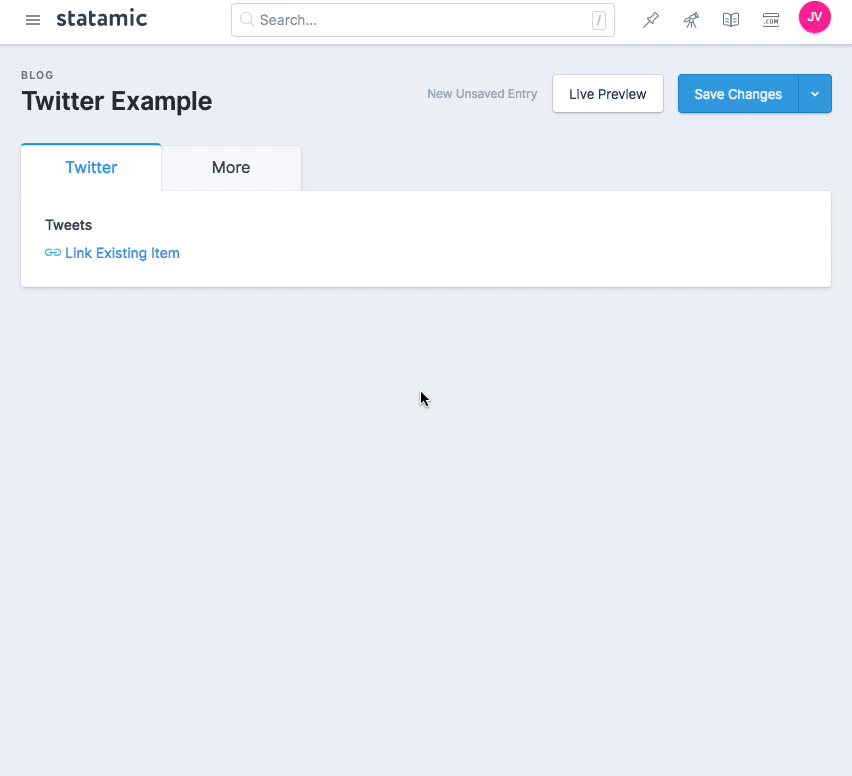

# Twitter

> A fieldtype for Statamic v3



## Installation

```
composer require statamic/twitter
php artisan vendor:publish --provider="Statamic\Twitter\ServiceProvider"
```

## Adding API Keys

This addon uses the [Jonathan Thuau's Twitter package](https://github.com/thujohn/twitter) under the hood. You will need to [create a Twitter app](https://apps.twitter.com/) and hook your API keys.

Once you've made your app, add the following to your `.env` file and enter the values:

``` 
TWITTER_CONSUMER_KEY=
TWITTER_CONSUMER_SECRET=
TWITTER_ACCESS_TOKEN=
TWITTER_ACCESS_TOKEN_SECRET=
```

## Fieldtype

Use the `twitter` fieldtype to select tweets from a given user.

``` yaml
fields:
  -
    handle: tweets
    field:
      type: twitter
      max_items: 3
      screen_name: jason_varga
```

The fieldtype will save a list of tweet status IDs.

``` yaml
tweets:
  - 12345
  - 67890
```

## Templating

The saved tweet IDs will be automatically augmented to useful data. Just use an array syntax to loop over them.

``` html
{{ tweets }}
    <blockquote>
        <p>{{ text }}</p>
        <p>– {{ user }}</p>
    </blockquote>
{{ /tweets }}
```
